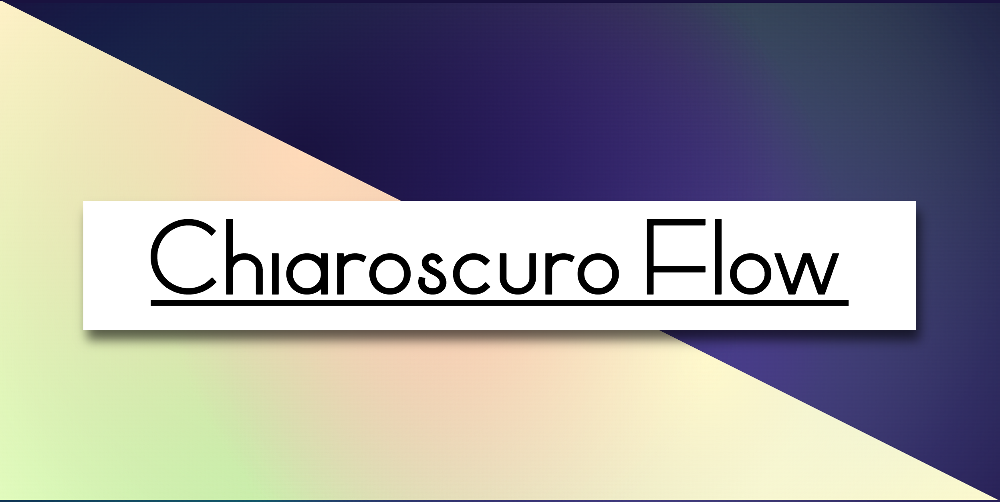
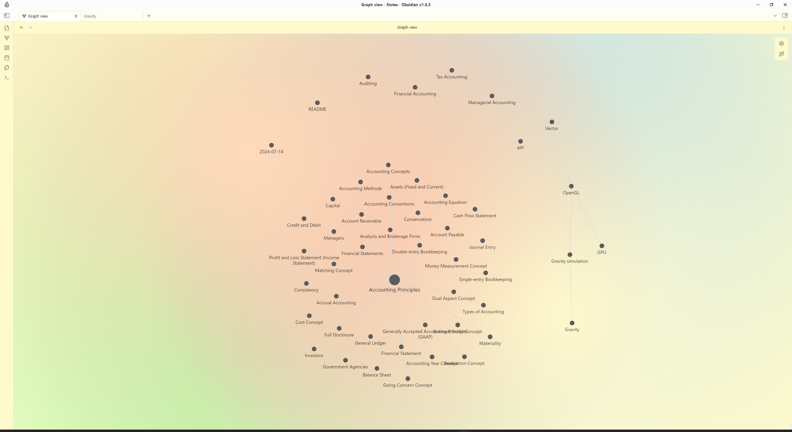
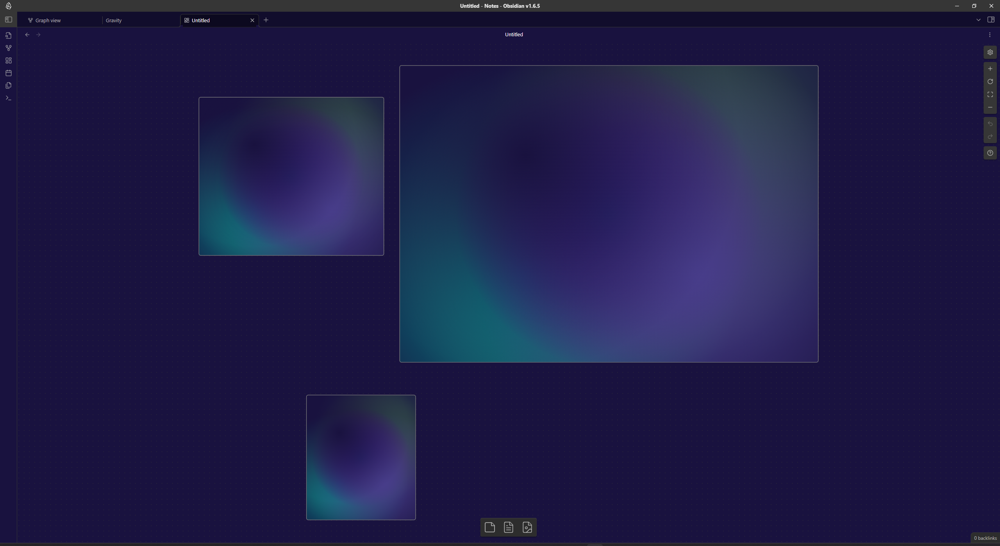

# Chiaroscuro Flow Obsidian Theme

Chiaroscuro Flow is a visually appealing and highly customizable theme for Obsidian that brings a unique blend of light and dark aesthetics to your note-taking experience. This theme features smooth gradients, elegant fonts, and configurable settings to match your preferences in both light and dark modes.

## Requirements

- **Style Settings Plugin:** This theme requires the [Style Settings Plugin](https://github.com/mgmeyers/obsidian-style-settings) to customize the theme settings. Make sure to install and enable this plugin to take full advantage of Chiaroscuro Flow's customization options.

## Features

### Custom Fonts
- **Body Font:** The default body font is `Manrope`, providing a clean and modern look to your notes.
- **Header Font:** The header font is `Nunito Sans Bold`, giving a bold and striking appearance to your headings.

### Color Customization
- **Light Mode:**
	- Primary Background: `#FFFFFF` (customizable)
	- Secondary Background: `#F0F0F0` (customizable)
	- Text Color: `#333333` (customizable)
	- Code Block Background: `#F0F0F0` (customizable)
	- Math Block Background: `#F0F0F0` (customizable)



- **Dark Mode:**
	- Primary Background: `#1E1E1E` (customizable)
	- Secondary Background: `#2D2D2D` (customizable)
	- Text Color: `#DDDDDD` (customizable)
	- Code Block Background: `#2D2D2D` (customizable)
	- Math Block Background: `#2D2D2D` (customizable)


### Gradients and Backgrounds
- **Light Mode Gradients:**
	- Soft Peach, Pale Gold, Light Coral, Powder Blue, Mint Green, Pale Blue, Lavender, and Light Pink

- **Dark Mode Gradients:**
	- Deep Purple, Dark Slate Blue, Midnight Blue, Dark Magenta, Dark Cyan, Dark Slate Gray, Dark Olive Green, and Dim Gray

### Print/PDF Export Compatibility
- The theme includes specific styles to ensure that gradient backgrounds are not applied when exporting to PDF, ensuring a clean and professional look for your exported documents.

### Readability Enhancements
- Text shadows are applied to headings to improve readability.
- Proper contrast adjustments are made for UI elements to ensure visibility in both light and dark modes.

### How to Use
1. Download and install the `Chiaroscuro Flow` theme through the community theme store.
2. Install and enable the [Style Settings Plugin](https://github.com/mgmeyers/obsidian-style-settings).
3. Activate the theme from the Obsidian settings.
4. Customize the theme settings according to your preferences via the Style Settings Plugin panel.

### Customization
You can further customize the theme by modifying the CSS variables defined in the theme file. Here's an example of how to adjust the primary background color in light mode:

```css
:root {
    --background-primary-light: #FFFAF0; /* Light Ivory */
}
